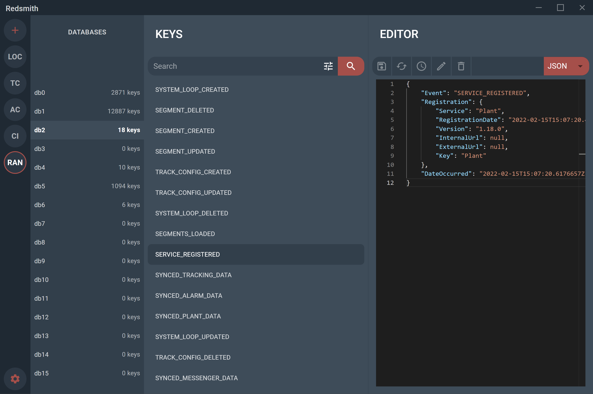

# Redis GUI

This Redis GUI currently only supports string values. This was initially developed as a replacement for an "old" Redis GUI (Redily), as the UI/UX for that was something I loved and wanted to re-create for the same experience.

## Contributing

I am open to PRs, if you feel there is something you could do better / improve upon, be my guest :star: